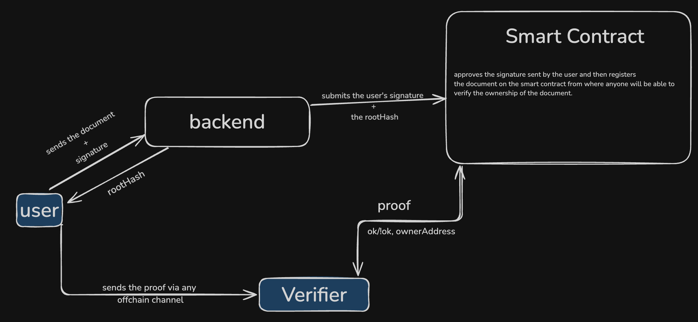

# 📄 MerkleDoc — On‑Chain Verifiable Document Proofs

MerkleDoc is a **Rust + Next.js + Solidity** stack that lets anyone prove the authenticity of any page in a document *and* publicly timestamp ownership on an EVM chain.



* **Off‑chain:** Each page is SHA‑256‑hashed and inserted into a Merkle tree; the root and every page hash are stored in MongoDB for fast queries.
* **On‑chain:** The Merkle root is **anchored** in the `Verify` smart‑contract together with the owner’s address and a timestamp, providing an immutable proof of existence and ownership.
* **Hybrid verification:** Anyone can (a) fetch a Merkle proof from the API and verify locally *or* (b) call `Verify.verify(...)` on‑chain for trust‑minimised validation.

---

## 🌳 Why Merkle Trees **and** Ethereum?

Merkle trees give inclusion proofs; anchoring the root on‑chain adds:

| Benefit                   | Why it matters                                                           |
| ------------------------- | ------------------------------------------------------------------------ |
| **Public timestamp**      | Root is mined in a block — impossible to back‑date.                      |
| **Ownership attestation** | Only the wallet that signs the EIP‑712 message can anchor.               |
| **Composable proofs**     | Smart contracts / dApps can consume `Verify.verify(...)` as a primitive. |

---

## ✨ End‑to‑End Flow

1. **Upload PDF** → backend extracts text & hashes each page.
2. **Merkle tree** is built → `root_hash` & `page_hashes[]` inserted into MongoDB.
3. **Wallet signature (EIP‑712)** — the UI asks the uploader to sign the root.
4. **Anchor on‑chain** — backend calls `Verify.anchorWithSig(...)` with the user’s signature.
5. **Proof / Verify**

   * `GET /documents/:id/proof/:page` → returns Merkle path.
   * Off‑chain verify *or* call `Verify.verify(...)` on smart contract.

---

## 🛠 Project Structure

```
merkle‑doc/
├─ backend/      # Rust · Actix‑Web · MongoDB
├─ contracts/    # Foundry (project for Verify.sol)
├─ frontend/     # Next.js · wagmi · ethers
└─ README.md
```

---

## 📦 1. Backend (Rust)

```bash
# prerequisites: Rust stable, MongoDB
cd backend
cp .env.example .env  # fill MONGODB_URI
cargo run
```

The backend exposes the same REST API **plus** a new `/anchor` helper that relays the signed root to Ethereum.

---

## ⛓️ 2. Smart Contract (Foundry)

`contracts/Verify.sol` (see below) anchors roots and verifies Merkle proofs.

### Compile & Test

```bash
cd contracts
forge build
forge test
```

### Deploy

```bash
source .env            # RPC_URL, PRIVATE_KEY
forge script script/DeployVerify.s.sol:DeployVerify \
  --rpc-url $RPC_URL --broadcast --verify
```

Grab the emitted address and place it in **both**:

* `frontend/.env.local` → `NEXT_PUBLIC_VERIFY_ADDRESS=`
* `backend/.env`        → `VERIFY_ADDRESS=`

### Contract ABI (excerpt)

| Function                                                                                 | Purpose                                                                                |
| ---------------------------------------------------------------------------------------- | -------------------------------------------------------------------------------------- |
| `anchorWithSig(bytes32 root,address owner,uint256 deadline,uint8 v,bytes32 r,bytes32 s)` | Stores `root → (owner, timestamp)` if the EIP‑712 signature is valid and nonce unused. |
| `verify(bytes32 root,bytes32 leaf,bytes32[] proof,bool[] isLeft)`                        | Pure Merkle‑path check; returns `bool`.                                                |

---

## 🖥 3. Frontend (Next.js + wagmi)

```bash
cd frontend
pnpm install
pnpm dev
```

Key additions:

* **`useAnchorDocument.ts`** — React hook that

  1. requests the user’s signature (`signTypedData()`),
  2. posts signature to `/anchor`,
  3. listens for `DocumentAccepted` event via wagmi.
* **On‑chain verify widget** — allows anyone to paste a Merkle proof and call the contract.

---

## 📡 API Routes (v2)

| Route                            | Description                                                                                                  |
| -------------------------------- | ------------------------------------------------------------------------------------------------------------ |
| `POST /documents`                | *(unchanged)* Upload PDF → returns `{ document_id, root_hash, n_pages }`.                                    |
| `POST /documents/:id/anchor`     | Accepts signer wallet address + deadline, returns typed‑data for signature. Backend submits `anchorWithSig`. |
| `GET /documents/:id/proof/:page` | *(unchanged)* Returns Merkle path.                                                                           |
| `POST /verify`                   | *(optional)* Off‑chain verification endpoint that mirrors contract logic for convenience.                    |

---

## 🔐 Security Notes

* Nonces in `Verify.sol` prevent replay of old signatures.
* Backend validates `docs[root] == 0` **before** asking for a signature to avoid wasted gas.
* SHA‑256 hashing is performed server‑side; if you need client‑side hashing for pure trustlessness, move the wasm build from `sha2` crate into the Next.js bundle.

---

## 📜 License

* Rust/TS code: MIT
* Solidity contracts: GPL‑3.0

---

> Built with 🦀 Rust, ☕ Next.js, and ⛓️ Foundry — because documents deserve cryptographic receipts.
